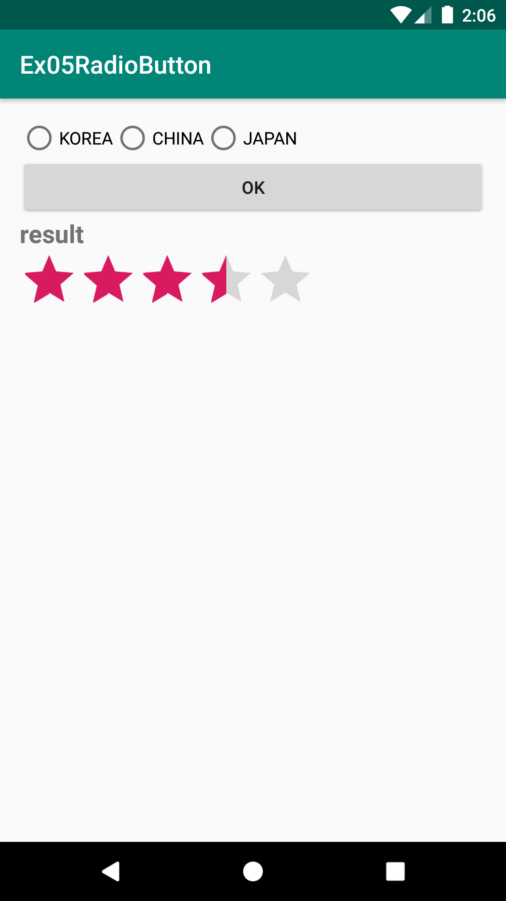
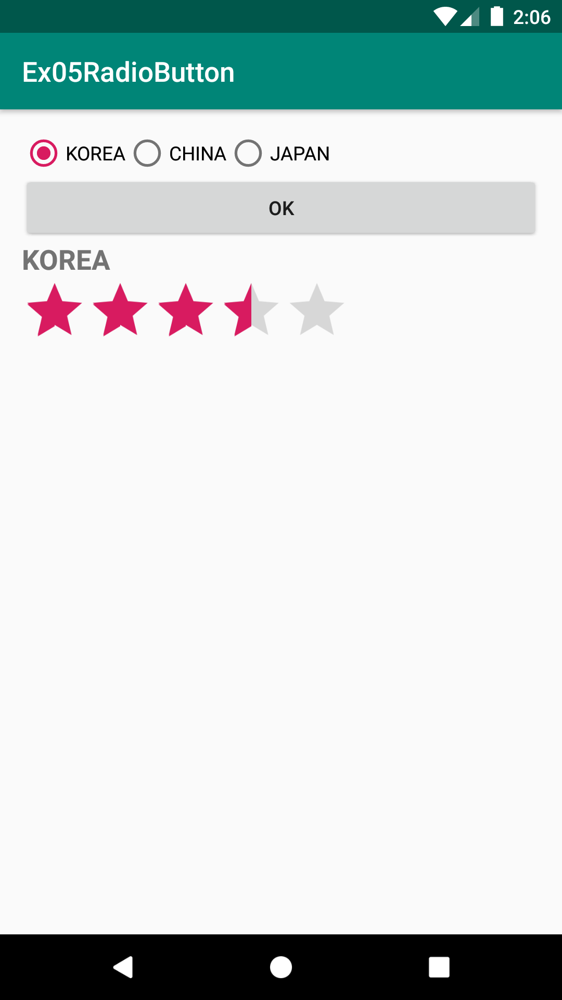
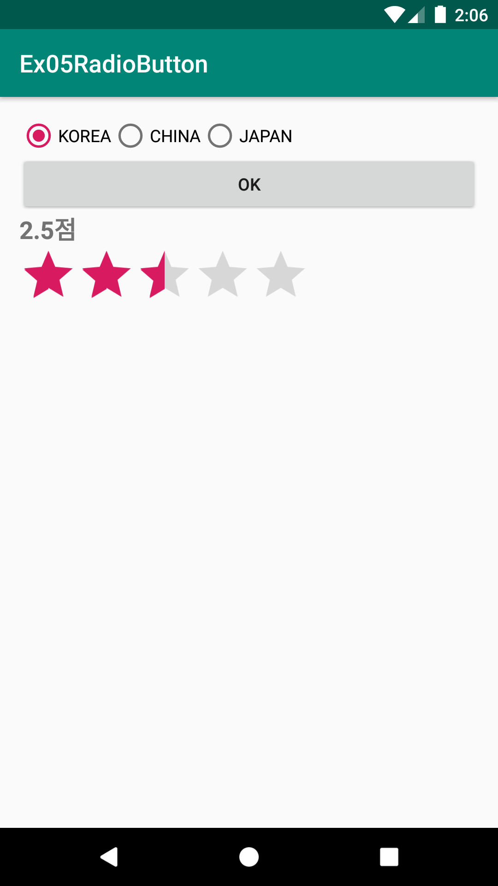
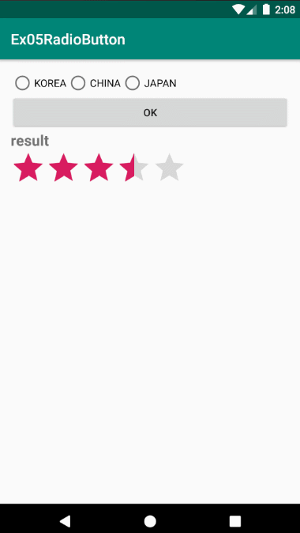

# Ex05RadioButton
안드로이드 네이티브 앱 개발 수업 예제#5

# 주요코드
RadioButton, RadioGroup, RatingBar 알아보기

- res폴더>>layout폴더안에 있는 activity_main.xml문서를 수정하여 화면제작
- RadioButton 3개와 Button 1개, TextView 1개를 만들어 버튼이 클릭되었을 때 선택(Selected)되어 있는 RadioButton의 텍스트를 얻어와 TextView에 표시하기
- RadioButton을 그냥 3개만들면 Single choice가 되지 않음. 라디어버튼3개가 하나의 그룹이 되도록 3개를 감싸는 RadioGroup뷰를 사용해야만 함.
- RadioButton의 선택(Selected)상태가 변경될 때마다 선택된 체크박스의 텍스트를 표시하기
- RadioButton이 아니라 RadioGroup에 리스너를 설정해야함. 선택상태 변경 리스너 객체 RadioGroup.OnCheckedChangeListener 소개
- RatingBar 위젯의 사용법은 다른 복합버튼들과 비슷함. 다만, 레이팅값의 변화 리스너객체 OnRatingBarChangeListener를 사용해야하는 것이 다름.

# 실행모습

  
  
  

# 실행모습 GIF

  

